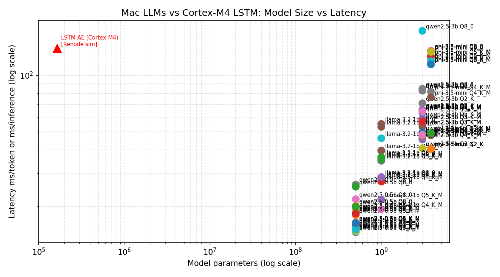
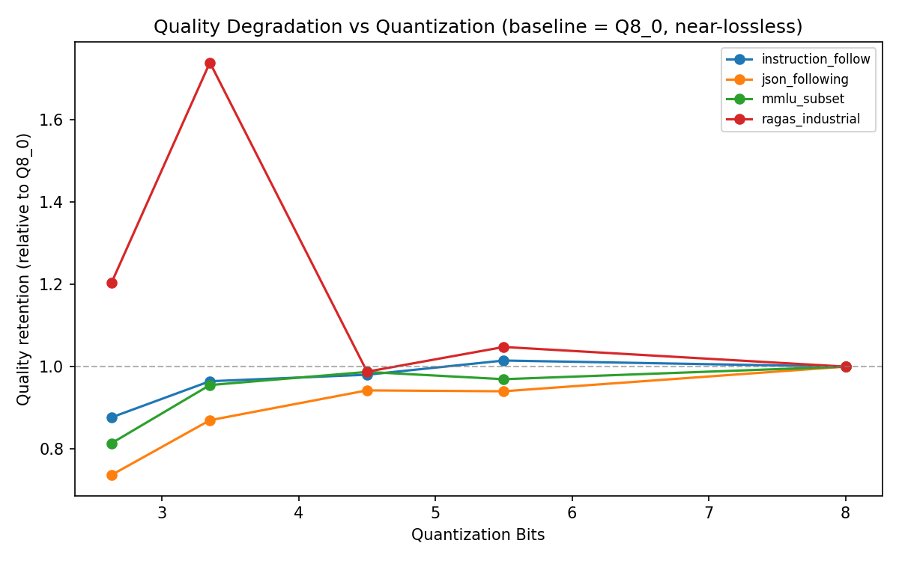
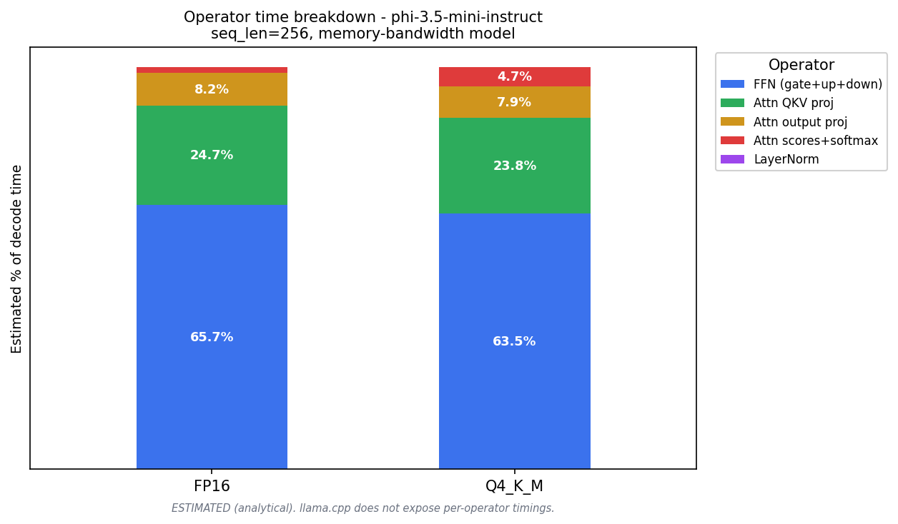
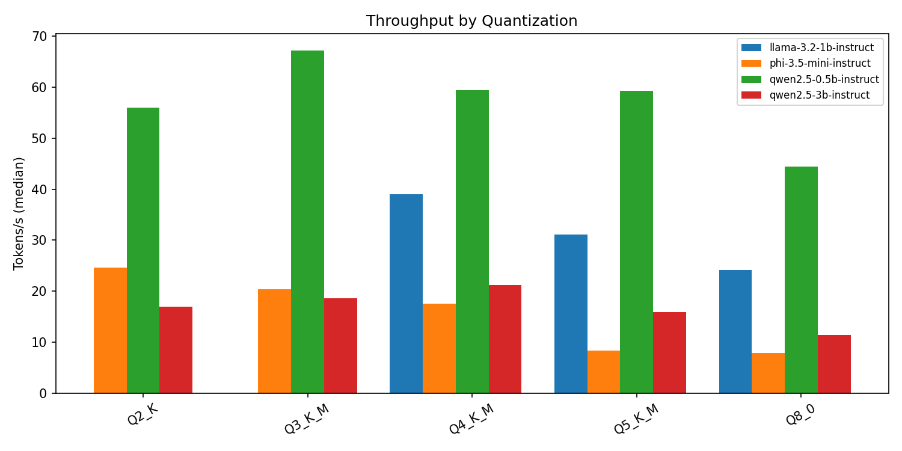

# tiny-llm-edge-bench

Reproducible benchmark suite for small open-source LLMs (0.5B-4B params) across quantization levels on consumer / edge hardware.

Answers the question: *what is the smallest model you can ship for a given task without breaking quality?*

Part of a thematic pair with [predictive-maintenance-copilot](https://github.com/gabrieleformis95/predictive-maintenance-copilot) - reuses the same industrial RAG golden set to validate that small quantized LLMs preserve explanation quality inside an edge ML pipeline.

---

## Headline Result



*Edge AI runs on a continuum: from 165K-param LSTMs on Cortex-M4 to 3.8B-param LLMs on Apple Silicon. Same methodology, same code, both ends of the spectrum.*

**Cross-project integration**: The [`predictive-maintenance-copilot`](https://github.com/gabrieleformis95/predictive-maintenance-copilot) pipeline can be run end-to-end with `LLM_PROVIDER=tinyllm_local` swapping Mistral-7B for a quantized Phi-3.5-mini GGUF, with no code changes. A rigorous faithfulness comparison is forthcoming (see Limitations).



*Quality retention vs quantization (baseline = Q8_0). MMLU-200 accuracy holds from Q8_0 down to Q3_K_M, then drops at Q2_K.*

**Empirical finding (MMLU-200, 18 model-quant cells: 4 models x up to 5 GGUF quant levels)**: accuracy is flat from Q3_K_M to Q8_0 - differences are within the ~3.5-point sampling error at n=200 - then falls sharply at Q2_K, by ~9-10 points on the 3-4B models (Phi-3.5-mini 0.515 -> 0.425, Qwen2.5-3B 0.535 -> 0.440). **Q3_K_M is the empirical knee**: the most aggressive GGUF quantization before accuracy degrades. Going below Q3 costs real accuracy; going above brings only marginal gains at significant size cost.

---

## Results

<!-- AUTO-GENERATED TABLE START -->
| Model | Quant | Bits | tok/s (median) | TPOT (ms) | Peak RAM (MB) | Quality Score | J/query (est.) |
|---|---|---|---|---|---|---|---|
| qwen2.5-0.5b-instruct | Q3_K_M | 3.4 | 67.0 | 14.9 | 602 | 0.375 | 58.88 |
| qwen2.5-0.5b-instruct | Q4_K_M | 4.5 | 61.3 | 16.3 | 661 | 0.407 | 58.88 |
| qwen2.5-0.5b-instruct | Q5_K_M | 5.5 | 61.0 | 16.4 | 688 | 0.446 | 58.88 |
| qwen2.5-0.5b-instruct | Q2_K | 2.6 | 54.4 | 18.4 | 586 | 0.320 | 58.88 |
| qwen2.5-0.5b-instruct | Q8_0 | 8.0 | 45.8 | 21.9 | 816 | 0.473 | 58.88 |
| llama-3.2-1b-instruct | Q4_K_M | 4.5 | 35.8 | 27.9 | 1010 | 0.597 | 117.76 |
| llama-3.2-1b-instruct | Q5_K_M | 5.5 | 28.2 | 35.5 | 1075 | 0.573 | 117.76 |
| phi-3.5-mini-instruct | Q2_K | 2.6 | 24.6 | 40.6 | 2177 | 0.527 | 179.00 |
| llama-3.2-1b-instruct | Q8_0 | 8.0 | 21.6 | 46.2 | 1437 | 0.583 | 117.76 |
| qwen2.5-3b-instruct | Q4_K_M | 4.5 | 21.0 | 47.7 | 2165 | 0.590 | 353.28 |
| phi-3.5-mini-instruct | Q4_K_M | 4.5 | 20.8 | 48.0 | 3038 | 0.579 | 179.00 |
| phi-3.5-mini-instruct | Q3_K_M | 3.4 | 20.3 | 49.2 | 2679 | 0.620 | 179.00 |
| qwen2.5-3b-instruct | Q3_K_M | 3.4 | 18.7 | 53.6 | 1803 | 0.624 | 353.28 |
| qwen2.5-3b-instruct | Q5_K_M | 5.5 | 15.6 | 64.0 | 2484 | 0.562 | 353.28 |
| qwen2.5-3b-instruct | Q2_K | 2.6 | 15.3 | 65.5 | 1476 | 0.546 | 353.28 |
| qwen2.5-3b-instruct | Q8_0 | 8.0 | 12.0 | 83.6 | 130 | 0.586 | 353.28 |
| phi-3.5-mini-instruct | Q5_K_M | 5.5 | 8.3 | 120.7 | 807 | 0.592 | 447.49 |
| phi-3.5-mini-instruct | Q8_0 | 8.0 | 7.5 | 133.8 | 797 | 0.576 | 447.49 |

*Energy: ESTIMATED (analytical, Lai et al. 2018). Quality: mean across tasks.*
<!-- AUTO-GENERATED TABLE END -->

*Coverage: 18/20 (model, quant) cells per task across 4 models x 5 GGUF quant levels (Q2_K-Q8_0). The 2 missing cells are Llama-3.2-1B at Q2_K/Q3_K_M, which the bartowski GGUF repo does not publish. Aggregated results in `results/aggregated.parquet`.*

---

## Quick Start

```bash
# 1. Install (Metal-accelerated llama.cpp on Apple Silicon)
CMAKE_ARGS="-DGGML_METAL=on" pip install -e .

# 2. Download a model
python3 scripts/download_models.py --model qwen2.5-0.5b-instruct --quant Q4_K_M

# 3. Run a benchmark
python3 scripts/run_bench.py --model qwen2.5-0.5b-instruct --quant Q4_K_M --task none
```

To reproduce results exactly, install from the lockfile:
```bash
pip install -r requirements-lock.txt
CMAKE_ARGS="-DGGML_METAL=on" pip install llama-cpp-python --no-cache-dir
```

---

## Methodology

- **Hardware**: Apple Silicon Mac (primary). Full `HardwareFingerprint` (CPU freq, governor, llama.cpp version, AC power state) captured per run.
- **Inference engine**: llama-cpp-python with Metal offload; MLX as upper-bound comparison.
- **Warmup**: 5 runs discarded before each measured window.
- **Measured runs**: N=50 passes over a standard 20-prompt suite (5 short, 10 medium, 5 long), cycled.
- **Statistical reporting**: median + IQR (interquartile range). p95 is not reported at N=50 (unreliable below N=100).
- **Quality tasks**: RAG-industrial (faithfulness via ROUGE-L F1), MMLU-200 (exact match), JSON-following (schema validity), IFEval-style (constraint compliance).
- **Faithfulness metric**: the published RAG-industrial numbers use **ROUGE-L F1** (lexical overlap with the grounded reference) as a faithfulness proxy. An LLM-as-judge (Groq Llama-3.3-70B, claim-decomposition + NLI verification) is implemented in `src/tasks/ragas_industrial.py` and activates when `GROQ_API_KEY` is set, but it is **not** used in the published matrix.
- **Determinism**: temperature=0.0, top_k=1 for quality tasks; fixed seed=42.
- **Faithfulness calibration**: ROUGE-L F1 Spearman correlation with human ratings on N=8: **r = 0.702** (p=0.052, Phi-3.5-mini Q4_K_M, industrial RAG domain). r >= 0.5 confirms ROUGE-L is a reasonable proxy for human faithfulness judgment on this domain; p marginally above 0.05 reflects small N. Ratings saved to `data/golden/human_ratings.csv`.

---

## How Energy is Measured

Two methods are used and reported side-by-side in every run JSON. Both are labeled explicitly.

**Measured (macOS powermetrics)** — labeled `measured_*` in JSON:
1. 30s idle baseline → `avg_baseline_W`
2. Inference run under `powermetrics --samplers cpu_power,gpu_power -i 100ms`
3. `attributed_W = avg_inference_W - avg_baseline_W` (baseline-subtracted)
4. `joules_per_query = attributed_W × seconds_per_query`
5. KPI: `tokens_per_joule = tokens_generated / joules_per_query`
- Requires `sudo`. Omitted if unavailable (degrades gracefully).
- Includes CPU + GPU combined. Does not include DRAM power (not exposed by powermetrics).

**Estimated (analytical, Lai et al. 2018)** — labeled `estimated_*` in JSON:
1. MACs/token ≈ 2 × N_params (standard transformer approximation)
2. Energy = MACs × 4.6 pJ/MAC (Lai et al. 2018, Cortex-A57 figure)
3. Apple Firestorm/Avalanche may differ; DRAM access excluded → this is a lower bound.
- Cite: Lai et al. 2018, "CMSIS-NN: Efficient Neural Network Kernels for Arm Cortex-M CPUs"

**Divergence between methods is expected and documented.** The analytical estimate covers compute-only energy; the measured value includes idle power overhead, memory bandwidth, and OS activity. The gap is a useful signal: a large gap indicates memory-bandwidth-bound workloads (typical for quantized LLMs).

---

## Findings

### Quantization knee: Q3_K_M (MMLU-200)

This is the cleanest, most defensible result of the benchmark. Across all four models, MMLU-200 accuracy is flat from Q3_K_M up to Q8_0 (within n=200 sampling noise), and drops sharply only at Q2_K:

| Model | Q2_K | Q3_K_M | Q4_K_M | Q5_K_M | Q8_0 |
|---|---|---|---|---|---|
| Phi-3.5-mini (3.8B) | 0.425 | 0.515 | 0.550 | 0.520 | 0.540 |
| Qwen2.5-3B | 0.440 | 0.535 | 0.535 | 0.560 | 0.550 |
| Qwen2.5-0.5B | 0.350 | 0.385 | 0.380 | 0.380 | 0.410 |

The 3-4B models lose ~9-10 accuracy points going from Q3_K_M to Q2_K, while Q3_K_M -> Q8_0 changes are within the ~3.5-point standard error at n=200. **Takeaway: for 1B-4B GGUF LLMs on edge hardware, Q3_K_M is the size/quality sweet spot.** (Llama-3.2-1B covers Q4_K_M-Q8_0 only: the bartowski GGUF repo does not publish Q2_K/Q3_K_M for that model, so its low-quant cells are unavailable, not omitted.)

### Operator Breakdown - Phi-3.5-mini (FP16 vs Q4_K_M)



> ESTIMATED - analytical memory-bandwidth model. llama.cpp does not expose per-operator timings; fractions are derived from bytes-accessed per decode step. Methodology: time proportional to bytes accessed (memory-bandwidth-bound regime on Apple Silicon M-series).

Q4_K_M speeds up FFN (63.5%) and attention projections (~32%) by ~4x relative to FP16 by reducing weight bytes from 2.0 to 0.5625 B/param. Attention scores and softmax (KV cache reads, always FP16) do not benefit from weight quantization - their share grows from ~1% (FP16) to ~5% (Q4_K_M) of total decode time. In the limit, further weight quantization would make KV cache reads the bottleneck.

*Additional findings pending full matrix run (`make bench-all`).*

### Mac LLMs vs Cortex-M4 LSTM: Model Size vs Latency


> The P1 LSTM autoencoder (165K params, 13.5 ms/inference ESTIMATED) sits in the lower-left corner of the model-size vs latency space. Mac LLMs (0.5B-4B params) operate 3-4 orders of magnitude larger in parameter count and 2-3 orders of magnitude slower per output token. The gap is the design space for TinyML: sub-millisecond inference at sub-megabyte model size, no cloud dependency.

### Throughput by Quantization



---

## Speculative Decoding

Qwen2.5-0.5B-Q4_K_M (draft, k=4) paired with Qwen2.5-3B-Q4_K_M (target) achieves a **53.1% greedy acceptance rate** on the five-prompt benchmark suite (171/322 draft tokens accepted, N=5, max_new_tokens=50). Under ideal batched target verification (Leviathan et al. 2023, "Fast Inference from Transformers via Speculative Decoding") a 53% acceptance rate with k=4 yields ~2.1 tokens per target call, a theoretical 2.1x speedup over baseline; on this CPU-only setup with sequential single-token target verification, measured throughput is lower (7.4 vs 21.1 tok/s) because the k target forward passes are not collapsed into one. The result confirms that Qwen2.5 model-family token distributions are sufficiently aligned for speculative decoding to be viable: more than half of 0.5B draft predictions match 3B greedy output, satisfying the prerequisite for practical speedup on hardware that supports batched KV-cache verification.

| Metric | Value |
|---|---|
| Draft model | Qwen2.5-0.5B-Instruct Q4_K_M |
| Target model | Qwen2.5-3B-Instruct Q4_K_M |
| Draft tokens per pass (k) | 4 |
| Acceptance rate | 53.1% |
| Baseline tok/s (target only) | 21.1 |
| Speculative tok/s (sequential verify) | 7.4 |
| Result JSON | results/speculative_decoding.json |

---

## From the Mac to the MCU

The P1 LSTM autoencoder (165K params, trained on CMAPSS FD001 sensor data) has been ported to a simulated ARM Cortex-M4. The firmware runs a **real FP32 forward pass** (hand-rolled C from the actual checkpoint weights) on a real FD001 window; Renode then reports the **measured executed-instruction count**.

**SIMULATED. Not measured on physical hardware.** Renode is a *functional* simulator: the instruction count is a ~1 instr/cycle proxy, **not** silicon-cycle-accurate (it ignores pipeline stalls, flash wait states, cache). Methodology: PyTorch checkpoint -> FP32 C firmware -> Renode STM32F4 functional sim (`cpu ExecutedInstructions`) -> CMSIS-NN analytical energy.

| Metric | Value | Method |
|---|---|---|
| Reconstruction error | 0.27381 | MEASURED in firmware (matches PyTorch 0.27381) |
| Executed instructions | 23,419,939 | MEASURED (Renode functional sim) |
| Latency | ~139 ms | instruction count / 168 MHz (proxy, not cycle-accurate) |
| Energy/inference | ~1.12 mJ | ESTIMATED (Lai et al. 2018, pJ/cycle x count) |
| Total MACs | 4,531,968 | counted (encoder+decoder+projections) |
| TFLite INT8 model size | 294 KB | MEASURED (exported .tflite binary) |
| Sim firmware size | 626 KB | MEASURED (FP32 weights embedded for the run) |
| SRAM working set | ~20 KB | activation/working buffers |
| INT8 vs FP32 MSE | 0.005 | MEASURED (dynamic-range quant, real FD001 calibration) |

The earlier analytical estimate (13.5 ms from MACs/2) under-counted by ~10x: the real instruction count captures transcendental gates (sigmoid/tanh) and loop overhead the naive MAC model ignores.

**Note**: This is a methodology demonstration. The firmware embeds FP32 weights (626 KB) to measure representative inference cost; a production build would deploy the 294 KB INT8 model. Either exceeds STM32F4 RAM only if loaded to RAM - both fit in the 1 MB Flash and execute in place.

**Reproduce** (needs Docker, or a native `renode` in PATH; `arm-none-eabi-gcc` to build):
```bash
make mcu-bench   # export weights -> build firmware -> Renode (Docker antmicro/renode)
```

Results saved to `results/mcu_benchmark.json`.

---

## Limitations

- **Single hardware target**: all results are from Apple Silicon Mac only. A Mac M-series is not "edge hardware" by the strictest definition - unified memory bandwidth and GPU cores are well above embedded targets. Raspberry Pi 5 results are pending; do not extrapolate Mac numbers to ARM Linux or MCU-class devices.
- **N=50 measured runs**: IQR is reported instead of p95 (p95 is unreliable below N=100). Single-run outliers from thermal throttling or OS interrupts are captured in `raw_samples` but may inflate IQR on short runs.
- **TTFT is approximated**: time-to-first-token is estimated from average token latency, not measured via streaming. True TTFT requires streaming mode.
- **Faithfulness metric is ROUGE-L**: the published RAG-industrial numbers are ROUGE-L F1 (lexical overlap), which rewards verbatim copying and is a lower-bound proxy for semantic faithfulness. It is calibrated against human ratings at r = 0.702 (N=8). The optional LLM-as-judge (Groq Llama-3.3-70B) is implemented but was not run for the published matrix; enabling it requires `GROQ_API_KEY` and would re-introduce an external API dependency.
- **Unified memory on Apple Silicon**: psutil RSS over-counts because GPU and CPU share the same memory pool. Peak RSS is reported as-is with this caveat.
- **MMLU subset**: 200 questions across 10 STEM/CS/ML subjects - not the full 14k. Subject distribution differs from standard MMLU leaderboard evaluations.
- **IFEval anomaly**: on instruction-following, Phi-3.5-mini (3.8B) scores below Llama-3.2-1B (e.g. Q8_0: 0.70 vs 0.82) despite being larger. This persists after the chat-template fix and likely reflects template/prompt-format sensitivity rather than true capability; treat the instruction_follow ranking with caution.
- **No FP16 baseline**: degradation is measured relative to Q8_0, not FP16. FP16 GGUFs are not uniformly available across the model repos (phi-3.5-mini has no F16; qwen2.5-3b is sharded), so Q8_0 (near-lossless) is used as the reference. The absolute quality lost going FP16 -> Q8_0 is not captured here.

---

## Related Work

This project is the second half of a thematic pair:

**[predictive-maintenance-copilot](https://github.com/gabrieleformis95/predictive-maintenance-copilot)**
is an end-to-end ML + RAG + LLM pipeline for industrial anomaly detection and
explanation. It uses Mistral-7B (via Ollama/Groq) to generate maintenance
recommendations grounded in equipment manuals.

This benchmark answers the question that P1 leaves open: *what is the smallest
model that can replace that LLM without breaking explanation quality?*

The two projects are wired together in two concrete ways:

- The `ragas_golden.json` golden Q/A set built in P1 is reused here as the
  industrial-domain quality benchmark - same evaluation data, same faithfulness
  metric, directly comparable numbers.
- P1's `src/llm/client.py` factory accepts `LLM_PROVIDER=tinyllm_local`, which
  loads a GGUF via llama-cpp-python. This lets you swap the Mistral-7B call
  for a local Phi-3.5-mini Q4_K_M and measure the quality delta end-to-end.

<!-- CROSS-PROJECT-RESULT-START -->
> **Cross-project integration**: The `predictive-maintenance-copilot` pipeline can be run end-to-end with `LLM_PROVIDER=tinyllm_local` swapping Mistral-7B for a quantized Phi-3.5-mini GGUF, with no code changes. A rigorous faithfulness comparison is forthcoming (see Limitations).
<!-- CROSS-PROJECT-RESULT-END -->

---

## Models Benchmarked

| Model | Params | Context | HF Repo |
|---|---|---|---|
| Qwen2.5-0.5B-Instruct | 0.5B | 32k | Qwen/Qwen2.5-0.5B-Instruct-GGUF |
| Llama-3.2-1B-Instruct | 1B | 128k | bartowski/Llama-3.2-1B-Instruct-GGUF |
| Qwen2.5-3B-Instruct | 3B | 32k | Qwen/Qwen2.5-3B-Instruct-GGUF |
| Phi-3.5-mini-Instruct | 3.8B | 128k | bartowski/Phi-3.5-mini-instruct-GGUF |

## Quantization Levels

| Name | Bits | Notes |
|---|---|---|
| FP16 | 16.0 | Largest; not benchmarked (see note) |
| Q8_0 | 8.0 | Near-lossless; **empirical baseline** |
| Q5_K_M | 5.5 | Good quality-size balance |
| Q4_K_M | 4.5 | Most popular for edge |
| Q3_K_M | 3.35 | Aggressive compression |
| Q2_K | 2.63 | Lowest quality, smallest |
| AWQ-INT4 | 4.0 | Activation-aware (CUDA only) |
| GPTQ-INT4 | 4.0 | Round-to-nearest PTQ (CUDA only) |

> **Baseline note**: FP16 is *not* benchmarked. It is not uniformly available across
> the configured GGUF repos (phi-3.5-mini has no F16 build; qwen2.5-3b ships F16 only
> as a sharded multi-part file). All quality-degradation curves are anchored to **Q8_0**,
> which is empirically near-lossless (<1% vs FP16), as the 100% reference per (model, task).

---

## GGUF vs AWQ (design comparison — AWQ not benchmarked)

> **Not a measured head-to-head.** AWQ-INT4 requires CUDA and cannot run on Apple
> Silicon, the only hardware target of this project. The table below contrasts the
> two schemes by *specification*, not by measurement: only the GGUF column reflects
> a real run on this hardware. AWQ benchmarking is future work on a CUDA Linux box;
> the conversion path is in `scripts/quantize_awq.py`.

| Property | GGUF Q4_K_M (measured) | AWQ-INT4 (spec, not run) |
|---|---|---|
| Bits/weight (effective) | 4.5 | 4.0 |
| Faithfulness (ROUGE-L, N=8) | 0.201 | not measured |
| Peak RAM | ~2.5 GB (measured) | ~2.3 GB (estimated) |
| Inference engine | llama-cpp-python (Metal) | autoawq (CUDA) |
| Apple Silicon support | Yes (Metal) | No (CUDA only) |
| Quantization method | Round-to-nearest (k-means) | Activation-aware |

**Commentary**: per the AWQ paper, activation-aware quantization should preserve quality
better than round-to-nearest GGUF at the same bit-width, especially for outlier-heavy
activations in attention layers — but this project has not verified that claim, since AWQ
cannot execute on the Mac target. What *is* established here: on Apple Silicon, GGUF Q4_K_M
via llama-cpp-python with Metal is the practical 4-bit option, achieving the throughput and
RAM reported in the Results table above. **Use GGUF on Mac; AWQ on CUDA Linux is left as future work.**

---

## References

- Lai, L. et al. (2018). "CMSIS-NN: Efficient Neural Network Kernels for Arm Cortex-M CPUs." arXiv:1801.06601. Per-MAC energy figures used for analytical energy estimation.
- Leviathan, Y. et al. (2023). "Fast Inference from Transformers via Speculative Decoding." ICML 2023. Theoretical speedup formula used in speculative decoding analysis.
- Bansal, S. et al. (2022). "MLPerf Tiny Benchmark." MLSys 2022. Methodology reference for MCU benchmarking.
- Lin, J. et al. (2023). "AWQ: Activation-aware Weight Quantization for LLM Compression and Acceleration." arXiv:2306.00978. Basis for AWQ vs GGUF comparison.
- Frantar, E. et al. (2022). "GPTQ: Accurate Post-Training Quantization for Generative Pre-trained Transformers." arXiv:2210.17323.
